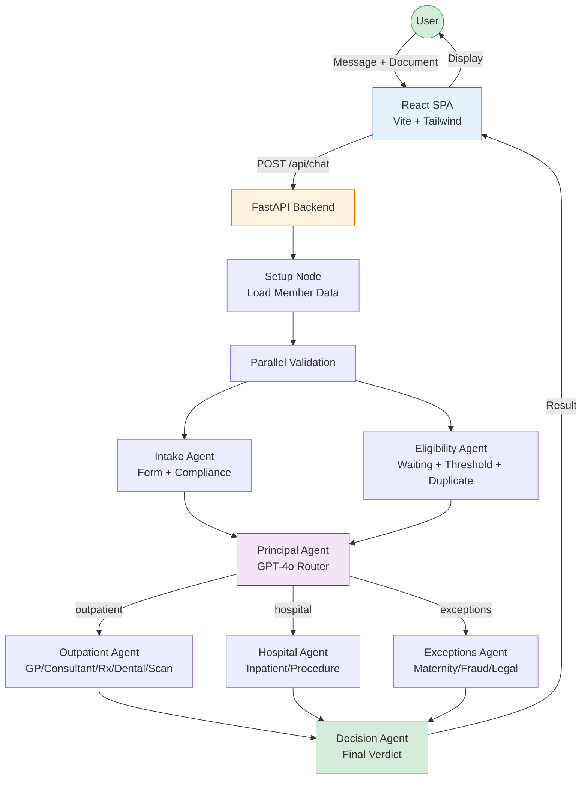

# Laya Healthcare AI Claims — Improvement Plan

> **Goal:** Transform this into an advanced, futuristic AI claims chatbot that impresses at demos with both stunning UI and real working functionality.

---

## 🔴 CRITICAL IMPROVEMENTS (Must-Have for Demo Impact)

### 1. Live Architecture Visualization (Developer Mode)
**Problem:** No way to see the agent pipeline flow in real-time during processing.
**Solution:** Add an interactive Mermaid-based architecture diagram that animates in real-time as each agent processes. Developers can see:
- Which agent is currently active (glowing/pulsing node)
- Data flowing between agents (animated edges)
- Status of each stage (pending/active/completed/failed)
- Click any node to see its input/output details

**Impact:** Massive demo wow-factor. Shows the entire multi-agent AI system visually.

### 2. Real-Time WebSocket Streaming
**Problem:** Backend has full WebSocket streaming (`/ws/chat`) but frontend only uses HTTP POST. Agent trace updates appear all at once after processing.
**Solution:** Connect WebSocket client in `useChat.js` to stream agent trace updates in real-time. Users see each agent step appear live as it happens.
- Typing indicator shows current agent name
- Pipeline stages animate one-by-one
- Architecture diagram nodes light up in sequence

**Impact:** Makes the AI feel alive and intelligent rather than a black box.

### 3. Smart Suggestions & Auto-Complete
**Problem:** Users don't know what to type. Only 6 static capability cards exist.
**Solution:** Add contextual smart suggestions that appear:
- After a claim is processed ("Check another claim", "Why was it rejected?", "What's my remaining coverage?")
- Based on member data ("You've used 8/10 GP visits this year")
- Quick follow-up chips below the AI response
- Predictive text as user types

**Impact:** Makes the chatbot feel intelligent and proactive.

### 4. Voice Input Support
**Problem:** Text-only input limits accessibility.
**Solution:** Add microphone button for speech-to-text using Web Speech API. Users can describe claims verbally.

**Impact:** Futuristic feel, accessibility, and demo impressiveness.

---

## 🟠 HIGH-PRIORITY UI IMPROVEMENTS

### 5. Enhanced Message Bubbles with Rich Cards
**Problem:** AI responses are plain markdown text. Claim results are embedded but basic.
**Solution:**
- Interactive claim result cards with expand/collapse sections
- Visual payout breakdown with animated progress bars
- Coverage comparison charts (what's covered vs. what's claimed)
- Step-by-step reasoning timeline within the message
- Animated € payout counter that counts up
- Color-coded policy rule explanations

### 6. Dark Mode Toggle
**Problem:** Sidebar is dark but main content is light. No user preference.
**Solution:** Full dark mode with smooth transition. Persisted in localStorage.

### 7. Notification/Toast System
**Problem:** No user feedback for actions like "file uploaded", "chat deleted", errors.
**Solution:** Elegant toast notifications with slide-in animation for all actions.

### 8. Mobile Responsive Design
**Problem:** 3-panel layout breaks on mobile/tablet.
**Solution:** Collapsible sidebar, swipeable panels, bottom navigation on mobile.

### 9. Loading Skeletons
**Problem:** Blank spaces while data loads.
**Solution:** Shimmer skeleton screens for member cards, chat list, and agent panel.

### 10. Keyboard Shortcuts
**Problem:** No power-user shortcuts.
**Solution:**
- `Ctrl+K` — New chat
- `Ctrl+/` — Toggle agent panel
- `Ctrl+U` — Upload file
- `Escape` — Close modals/panels

---

## 🟡 AI & BACKEND IMPROVEMENTS

### 11. Streaming Response Text
**Problem:** AI responses appear all at once after full processing.
**Solution:** Stream the final reasoning text word-by-word (typewriter effect) while showing full agent trace progress.

### 12. Conversation Context Display
**Problem:** Multi-turn works but user can't see conversation context being used.
**Solution:** Show "Continuing conversation" indicator with reference to previous claim context. Display conversation thread summary.

### 13. Claim Comparison
**Problem:** Can't compare similar previous claims.
**Solution:** "Similar claims" section showing how similar claims were decided for the same member or other members (anonymized).

### 14. Policy Knowledge Base Chat
**Problem:** Users can only submit claims, can't ask general policy questions.
**Solution:** General Q&A mode where users can ask "What does my plan cover for dental?" without submitting a claim document. Principal agent routes to either claim processing OR knowledge base.

### 15. Claim History Dashboard
**Problem:** Claim history exists but is basic list format.
**Solution:** Visual dashboard with:
- Monthly/quarterly claim charts
- Category breakdown pie chart
- Total reimbursements timeline
- Pending vs. approved vs. rejected stats

### 16. Error Recovery & Retry
**Problem:** Single agent error crashes the entire pipeline.
**Solution:** 
- React error boundaries per component
- Retry button on failed API calls
- Graceful degradation (show partial results if one agent fails)
- Auto-retry with exponential backoff

---

## 🟢 CONSUMER EXPERIENCE IMPROVEMENTS

### 17. Guided Claim Submission Wizard
**Problem:** Users confused about what information is needed upfront.
**Solution:** Optional step-by-step wizard mode:
1. "What type of claim?" → Visual category selector
2. "When was the treatment?" → Date picker
3. "How much did it cost?" → Amount input
4. "Who was the practitioner?" → Text input
5. Review & Submit → Shows formatted claim before processing

This runs parallel to the natural language input — users choose their preferred method.

### 18. Claim Status Tracker
**Problem:** Once submitted, users don't know claim status.
**Solution:** Order-tracking style progress bar:
- Submitted → Under Review → Processing → Decision Made
- Push notification/badge when status changes
- Estimated processing time

### 19. Document Preview
**Problem:** Uploaded files disappear after upload.
**Solution:** 
- PDF/image thumbnail preview
- Extracted data overlay showing what the AI read
- Ability to correct extracted data before submitting

### 20. Help & Onboarding Tour
**Problem:** New users don't know how to use the app.
**Solution:**
- First-time interactive tour highlighting key features
- "?" help button with contextual tooltips
- Sample walkthrough with demo data

### 21. Multi-Language Support
**Problem:** English only.
**Solution:** i18n framework for Irish, Polish, and other common languages in Ireland.

### 22. Accessibility (a11y)
**Problem:** Limited keyboard navigation, no screen reader support.
**Solution:** ARIA labels, focus management, high contrast mode, reduced motion option.

---

## 🔵 DEVELOPER EXPERIENCE IMPROVEMENTS

### 23. Live Architecture Monitor Page
**Problem:** No dedicated view for understanding the full system.
**Solution:** New `/architecture` route (developer-only) showing:
- Interactive Mermaid diagram of the full agent hierarchy
- Real-time processing stats (avg response time, success rate)
- Live log stream from all agents
- Node click → shows prompt, tools, and last 10 invocations
- Performance metrics per agent

### 24. Agent Configuration Panel
**Problem:** Agent prompts/config require code changes.
**Solution:** Developer UI to:
- View/edit agent system prompts
- Toggle LLM vs. deterministic mode per agent
- Adjust temperature, model, and other LLM params
- A/B test different prompt versions

### 25. Test Case Runner
**Problem:** No tests, can't validate changes quickly.
**Solution:** Built-in test runner with pre-defined scenarios:
- "GP Approved" → Expected: APPROVED, €20
- "Over Limit" → Expected: REJECTED
- "Maternity" → Expected: APPROVED, €200
- Run all and see pass/fail summary

### 26. Database Inspector
**Problem:** In-memory data invisible to developers.
**Solution:** Developer panel showing:
- All members with editable fields
- Current usage stats
- Claims history
- Conversation sessions
- Reset data button

---

## 📐 TECHNICAL DEBT

### 27. Persistent Storage
Replace in-memory Python dicts with SQLite (dev) / PostgreSQL (prod).

### 28. Remove Dead Code
Delete unused `Sidebar.jsx`, clean unused imports.

### 29. Proper PDF OCR
Enable real OCR or integrate PyMuPDF/pdfplumber for reliable PDF text extraction.

### 30. Security Hardening
- Restrict CORS origins
- Rotate JWT secrets
- Add rate limiting per user, not just per IP
- Add CSRF protection

### 31. Testing Suite
- Backend: pytest unit tests for each agent, tool, and router
- Frontend: React Testing Library for components
- E2E: Playwright or Cypress for full user flows

### 32. Environment Configuration
- `.env.example` with all required variables
- Docker Compose for one-command setup
- CI/CD pipeline configuration

---

## 🎯 IMPLEMENTATION PRIORITY ORDER

| Phase | Items | Timeline | Demo Impact |
|-------|-------|----------|-------------|
| **Phase 1** | #1 (Architecture Viz), #3 (Smart Suggestions), #5 (Rich Cards), #7 (Toasts), #16 (Error Recovery) | Week 1 | ⭐⭐⭐⭐⭐ |
| **Phase 2** | #2 (WebSocket), #6 (Dark Mode), #9 (Skeletons), #11 (Streaming Text), #17 (Wizard) | Week 2 | ⭐⭐⭐⭐ |
| **Phase 3** | #4 (Voice), #10 (Shortcuts), #15 (History Dashboard), #23 (Monitor Page) | Week 3 | ⭐⭐⭐⭐ |
| **Phase 4** | #14 (Policy QA), #18 (Status Tracker), #19 (Doc Preview), #20 (Onboarding) | Week 4 | ⭐⭐⭐ |
| **Phase 5** | #27-32 (Tech Debt), #24-26 (Dev Tools) | Ongoing | ⭐⭐ |

---

## Architecture Diagram (Current System)

